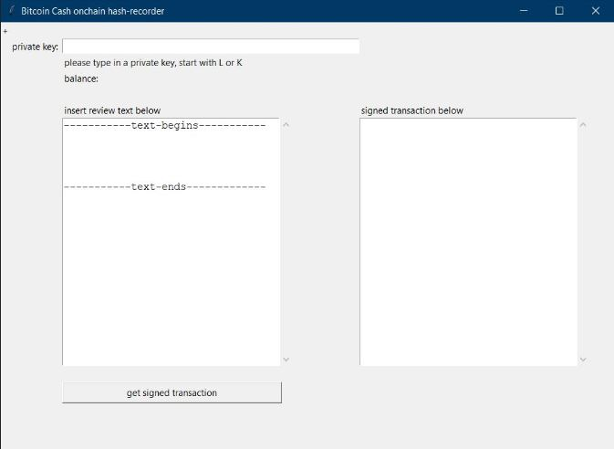

# Bitcoin-Cash-text-hash

**1. What is this?**

* This is a little Python GUI that allows hashing of your text (using sha256d) and forms a serialized transaction that includes an ```OP_RETURN ``` output of the hash. 

**2. What are the required packages?**

* Python 3.x (tested on 3.7)
* ```ecdsa``` package
* ```tkinter``` package

**3. How do I use the GUI?**
* Download ```BCH_cash_addr_tools.py```, ```BCH_text_txn.py```, ```b58.py```
* Run ```BCH_text_txn.py```

**4. What does the GUI look like?**
* 

**5. If you would like to support me, please donate:**

* bitcoincash:qzdjkeate68u7ru2rvtnqtp0hp60akq4j550uyn7aw
